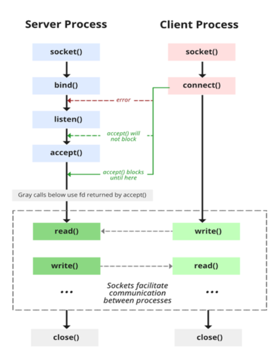

# Create local socket

How simple is it to communicate using a socket?

## Command

```
execute in a first console
gcc server.c -o server
./server
```

```
in a second one
nc -U /tmp/echo.sock
```

## Learning


